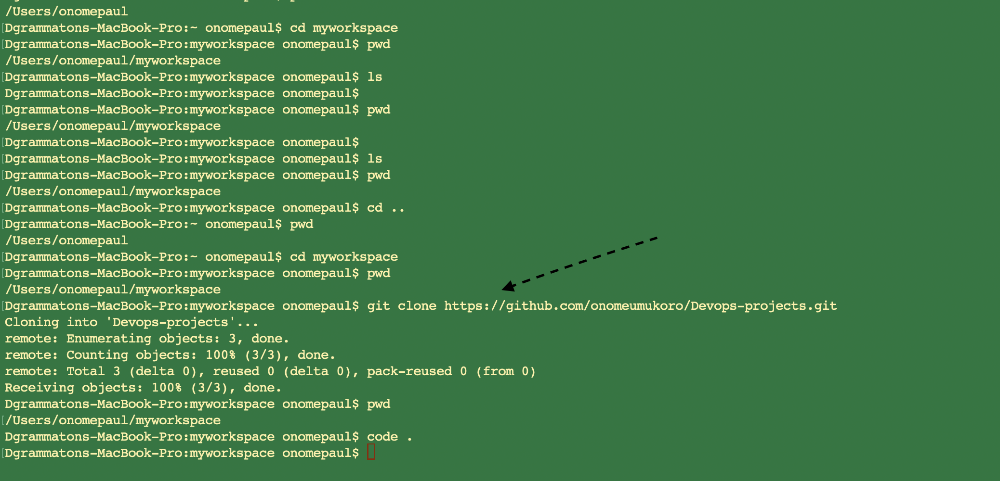
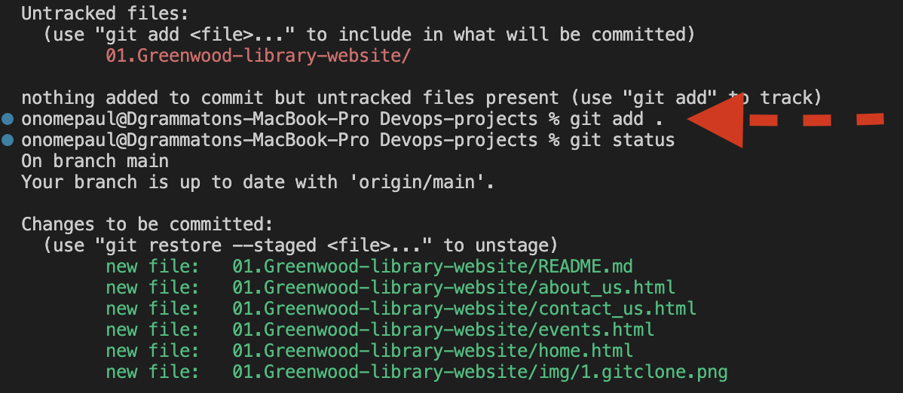
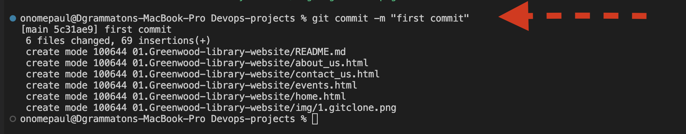
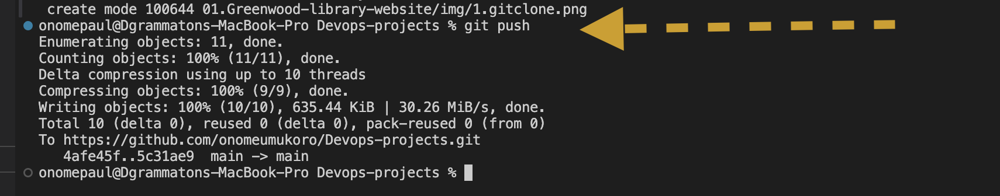

# Greenwood Library Website Project 

In these project, I am practicing repository cloning, creating and working with branches in git, git staging, commiting, pushing of changes for multiple developers as well as creating pull request, merging them and also resolving any potential conflicts that may arise.

## Git Clone

The git clone command is used to create a copy of a specific repository or branch within a repository

To use Git clone type the syntax `git clone`

## Git add

The git add (staging) command adds a change to the working directory in the staging area

To use git add, type the syntax `git add .`

## Git commit

The git commit saves the state (changes) of the project including all the tracked files while assigning a unique identifier.

To use git commit , type the syntax `git commit -m`

## Git Push

The git push command is used to push the local repository content to a remote repository 

To use git push, type the syntax `git push`

